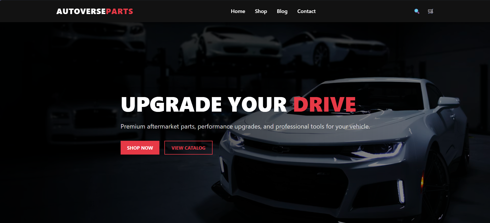
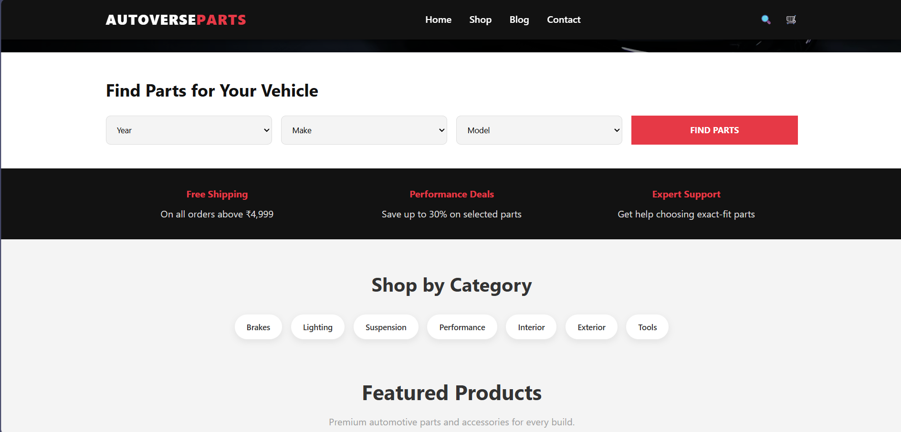
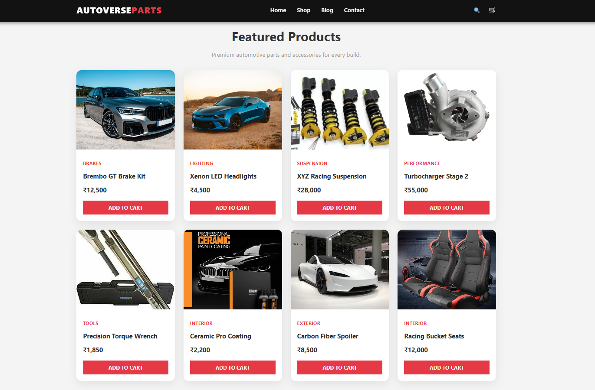

# AutoVerse Parts

A modern **car parts ecommerce website** built with React and Vite. The project uses reusable React components, plain CSS, product filtering, and a cart count UI pattern, which aligns with common React ecommerce architecture practices that emphasize component-based structure and modular styling. [1][2][3]

## Preview

AutoVerse Parts is designed as an automotive storefront for selling aftermarket parts, garage tools, lighting kits, suspension products, and other car accessories. The app structure follows a multi-component React layout with separate sections for navigation, hero, vehicle finder, promotions, categories, product cards, and footer content. [1][2][4]

## Features

- Responsive automotive ecommerce homepage. [5]
- Built with React + Vite for fast local development. [6][7]
- Reusable components for clean project structure. [1][2]
- Category-based product filtering using React state. [1]
- Cart item count in the navbar. [3]
- Separate CSS files for component-level styling, a common React styling approach. [8][9][10]

## Tech Stack

- React
- Vite
- JavaScript (JSX)
- CSS3
- Git & GitHub

## Folder Structure

```text
autoverse-parts/
├── public/
├── src/
│   ├── assets/
│   ├── components/
│   │   ├── Navbar.jsx
│   │   ├── Hero.jsx
│   │   ├── VehicleFinder.jsx
│   │   ├── PromoBanner.jsx
│   │   ├── CategorySection.jsx
│   │   ├── ProductGrid.jsx
│   │   ├── ProductCard.jsx
│   │   └── Footer.jsx
│   ├── data/
│   │   └── products.js
│   ├── styles/
│   │   ├── global.css
│   │   ├── Navbar.css
│   │   ├── Hero.css
│   │   ├── VehicleFinder.css
│   │   ├── PromoBanner.css
│   │   ├── CategorySection.css
│   │   ├── ProductGrid.css
│   │   └── Footer.css
│   ├── App.jsx
│   └── main.jsx
├── index.html
├── package.json
└── vite.config.js
```

## Components

| Component | Purpose |
|---|---|
| `Navbar` | Displays logo, nav links, search icon, and cart count. |
| `Hero` | Main landing banner with headline and CTA buttons. |
| `VehicleFinder` | Lets users choose year, make, and model to find parts. |
| `PromoBanner` | Shows promotional offers and trust signals. |
| `CategorySection` | Displays category filter buttons. |
| `ProductGrid` | Renders filtered product cards from local data. |
| `ProductCard` | Shows product image, category, name, price, and add-to-cart button. |
| `Footer` | Displays brand summary, quick links, and contact details. |

## Getting Started

### 1. Clone the repository

```bash
git clone https://github.com/manthan-patil-dev/autoverse-parts.git
cd autoverse-parts
```

### 2. Install dependencies

```bash
npm install
```

### 3. Run the development server

```bash
npm run dev
```

Vite will start a local development server, typically on `http://localhost:5173/`. [6][7]

## Database

 
make your first website
Completed 2 steps
Your first website should be a simple one-page personal portfolio: hero section, about, projects, skills, and contact. That format is beginner-friendly, mobile-friendly, and matches common portfolio best practices like clear purpose, simple navigation, and strong project visibility.

What to build
Start with these sections:

Hero: your name, role, and one-line intro, because portfolio sites should immediately say who you are and what you do.

About: a short paragraph about your background and goals, since personal websites work best when the content feels clear and personal.

Projects: 2–4 of your best builds, because strong case studies matter more than lots of weak thumbnails.

Contact: email, GitHub, LinkedIn, and maybe Instagram/YouTube if they support your developer brand.

Good first layout
A clean first portfolio usually works best with minimal navigation, readable typography, and a simple structure rather than flashy effects. Several guides recommend focusing on purpose, easy use, mobile responsiveness, and content that sounds like you.

Use this page flow:

Header with your name and nav links.

Hero with intro and one main button like “View Projects.”

About and skills section.

Projects grid.

Contact/footer.

What to avoid
Do not try to make your first site overly animated or complicated, because experienced developers often advise that fundamentals like spacing, contrast, responsiveness, and clear content matter more than “fancy” effects in a first portfolio.

Also avoid vague copy like “Welcome to my website” and instead say something specific such as “Computer engineering student building AI, full-stack, and automation projects.”

Starter code
Here is a simple first version you can paste into an index.html file and open in your browser:

xml
<!DOCTYPE html>
<html lang="en">
<head>
  <meta charset="UTF-8" />
  <meta name="viewport" content="width=device-width, initial-scale=1.0" />
  <title>Manthan Patil | Portfolio</title>
  <style>
    * { margin: 0; padding: 0; box-sizing: border-box; }
    body {
      font-family: Arial, sans-serif;
      line-height: 1.6;
      background: #f4f4f4;
      color: #222;
    }
    header {
      background: #111;
      color: white;
      padding: 16px 32px;
      display: flex;
      justify-content: space-between;
      align-items: center;
    }
    nav a {
      color: white;
      text-decoration: none;
      margin-left: 16px;
    }
    section {
      padding: 60px 20px;
      max-width: 1000px;
      margin: auto;
    }
    .hero {
      text-align: center;
      padding: 100px 20px;
    }
    .hero h1 {
      font-size: 2.5rem;
      margin-bottom: 10px;
    }
    .btn {
      display: inline-block;
      margin-top: 20px;
      padding: 12px 20px;
      background: #0077ff;
      color: white;
      text-decoration: none;
      border-radius: 8px;
    }
    .projects {
      display: grid;
      grid-template-columns: repeat(auto-fit, minmax(220px, 1fr));
      gap: 20px;
    }
    .card {
      background: white;
      padding: 20px;
      border-radius: 10px;
      box-shadow: 0 4px 10px rgba(0,0,0,0.08);
    }
    footer {
      text-align: center;
      padding: 20px;
      background: #111;
      color: white;
    }
  </style>
</head>
<body>
  <header>
    <h2>Manthan Patil</h2>
    <nav>
      <a href="#about">About</a>
      <a href="#projects">Projects</a>
      <a href="#contact">Contact</a>
    </nav>
  </header>

  <section class="hero">
    <h1>Hello, I'm Manthan</h1>
    <p>Computer engineering student building AI, web, and software projects.</p>
    <a href="#projects" class="btn">View Projects</a>
  </section>

  <section id="about">
    <h2>About Me</h2>
    <p>
      I am a diploma student in Computer Engineering from Maharashtra, interested in
      AI/ML, full-stack development, and cloud-based applications.
    </p>
  </section>

  <section id="projects">
    <h2>Projects</h2>
    <div class="projects">
      <div class="card">
        <h3>AI Chatbot</h3>
        <p>A chatbot project using Python and APIs.</p>
      </div>
      <div class="card">
        <h3>Portfolio Website</h3>
        <p>A personal website to showcase my work and skills.</p>
      </div>
      <div class="card">
        <h3>Stock Analysis Tool</h3>
        <p>A project for analyzing stock trends and recommendations.</p>
      </div>
    </div>
  </section>

  <section id="contact">
    <h2>Contact</h2>
    <p>Email: yourmail@example.com</p>
    <p>GitHub: github.com/yourusername</p>
  </section>

  <footer>
    <p>© 2026 Manthan Patil</p>
  </footer>
</body>
</html>
Best next step
Your best next version is to customize this into a developer portfolio with your real projects, GitHub links, internship experience, and tech stack, since portfolio guidance consistently recommends preparing your content first and making the site feel specific to you.

Would you like me to build a more modern personal portfolio website for you in one complete HTML file using your background?

in react .jsx not html

Yes — in React you should write it as a .jsx component, not a plain HTML file. JSX lets you build the UI as reusable components, which is the standard React approach for modern portfolio sites.

App structure
A beginner React portfolio is usually split into small functional components such as Navbar, Hero, About, Projects, and Contact, because React components are meant to be reusable, isolated UI pieces.

Also, JSX should stay readable, use one parent wrapper, and use semantic tags where possible.

Use this structure:

App.jsx

components/Navbar.jsx

components/Hero.jsx

components/About.jsx

components/Projects.jsx

components/Contact.jsx

Example JSX
Here is a simple App.jsx version of your first portfolio website:

jsx
import React from "react";

const projects = [
  {
    title: "AI Chatbot",
    desc: "A chatbot project using Python and APIs."
  },
  {
    title: "Stock Analysis Tool",
    desc: "A project for analyzing stock trends and recommendations."
  },
  {
    title: "Portfolio Website",
    desc: "My personal website built with React."
  }
];

export default function App() {
  return (
    <div style={styles.page}>
      <header style={styles.header}>
        <h2>Manthan Patil</h2>
        <nav style={styles.nav}>
          <a href="#about" style={styles.link}>About</a>
          <a href="#projects" style={styles.link}>Projects</a>
          <a href="#contact" style={styles.link}>Contact</a>
        </nav>
      </header>

      <section style={styles.hero}>
        <h1>Hello, I'm Manthan</h1>
        <p>Computer engineering student building AI, web, and software projects.</p>
        <a href="#projects" style={styles.button}>View Projects</a>
      </section>

      <section id="about" style={styles.section}>
        <h2>About Me</h2>
        <p>
          I am a computer engineering diploma student from Maharashtra, interested in
          AI/ML, full-stack development, cloud tools, and building real-world projects.
        </p>
      </section>

      <section id="projects" style={styles.section}>
        <h2>Projects</h2>
        <div style={styles.grid}>
          {projects.map((project, index) => (
            <div key={index} style={styles.card}>
              <h3>{project.title}</h3>
              <p>{project.desc}</p>
            </div>
          ))}
        </div>
      </section>

      <section id="contact" style={styles.section}>
        <h2>Contact</h2>
        <p>Email: yourmail@example.com</p>
        <p>GitHub: github.com/yourusername</p>
        <p>LinkedIn: linkedin.com/in/yourusername</p>
      </section>
    </div>
  );
}

const styles = {
  page: {
    fontFamily: "Arial, sans-serif",
    background: "#f4f4f4",
    color: "#222",
    minHeight: "100vh"
  },
  header: {
    background: "#111",
    color: "#fff",
    padding: "16px 32px",
    display: "flex",
    justifyContent: "space-between",
    alignItems: "center",
    flexWrap: "wrap"
  },
  nav: {
    display: "flex",
    gap: "16px"
  },
  link: {
    color: "#fff",
    textDecoration: "none"
  },
  hero: {
    textAlign: "center",
    padding: "80px 20px"
  },
  button: {
    display: "inline-block",
    marginTop: "20px",
    padding: "12px 20px",
    background: "#0077ff",
    color: "#fff",
    textDecoration: "none",
    borderRadius: "8px"
  },
  section: {
    maxWidth: "1000px",
    margin: "0 auto",
    padding: "50px 20px"
  },
  grid: {
    display: "grid",
    gridTemplateColumns: "repeat(auto-fit, minmax(220px, 1fr))",
    gap: "20px",
    marginTop: "20px"
  },
  card: {
    background: "#fff",
    padding: "20px",
    borderRadius: "10px",
    boxShadow: "0 4px 10px rgba(0,0,0,0.08)"
  }
};
Better React style
For real projects, it is better to split components into separate files instead of putting everything in one file, because React encourages modular components and easier reuse.

It is also better to avoid large inline styles for bigger apps and move styling into CSS files, CSS modules, or a utility framework like Tailwind.

Example:

jsx
import Navbar from "./components/Navbar";
import Hero from "./components/Hero";
import About from "./components/About";
import Projects from "./components/Projects";
import Contact from "./components/Contact";

export default function App() {
  return (
    <>
      <Navbar />
      <Hero />
      <About />
      <Projects />
      <Contact />
    </>
  );
}
Vite setup
A common beginner setup is React with Vite, which many modern tutorials use for creating portfolio projects and organizing components cleanly.

Typical files are:

src/main.jsx

src/App.jsx

src/components/...

src/App.css

If you want, I can give you a full React portfolio in JSX + CSS, ready to paste into a Vite project.

then told we can make full website with ai so make a next level ecommerce website
Completed 4 steps
README
Next Level Ecommerce Demo
This is a React JSX ecommerce landing page/storefront concept built as a single-page demo.

Files
src/App.jsx — main React component

src/styles.css — styling

Use in Vite
Create a React app with Vite:
npm create vite@latest next-level-ecommerce -- --template react

Replace the generated src/App.jsx with this App.jsx

Replace src/index.css or add src/styles.css

Import ./styles.css in App.jsx

Run:
npm install
npm run dev

Features
Premium hero section

Product filtering

Add-to-cart interaction

Responsive layout

Modern ecommerce styling


Open README
Yes — you can absolutely make a full AI-made ecommerce website in React, and I created a next-level JSX storefront concept with a premium hero section, interactive product filtering, add-to-cart behavior, and responsive modern styling. React is a good fit for this because ecommerce UIs benefit from reusable components, state for cart/filter interactions, and modular page sections.

What it includes
The demo is designed like a premium gadget brand store, which matches your earlier interest in tech-focused ecommerce and social-content-driven selling. It includes a bold landing hero, featured offers, category filters, product cards, live cart count, and a polished dark UI aimed at a modern gadget-store feel.

Why this style works
Modern ecommerce inspiration in 2026 emphasizes immersive brand experience, mobile-first layouts, micro-interactions, bento-style sections, strong product visuals, and friction-light conversion paths. High-quality imagery, clear value messaging, simple navigation, and visible calls to action are also repeatedly highlighted as important for better ecommerce UX and conversion.

Files
I prepared:

App.jsx — the full React page component with product data, filters, and cart state.

styles.css — premium responsive styling for the storefront.

README.md — quick setup steps for running it in a Vite React project.

Use it
Put the files into a Vite React app, then run npm install and npm run dev to view the site locally, which is a common React starter workflow for portfolio and storefront projects.

Would you like me to make the next version as a full multi-page ecommerce app with product details, cart drawer, checkout form, login, and admin dashboard?

now to update this on github

Yes — to update the GitHub repo after changing the Browse Categories color, run the normal Git add/commit/push workflow from your project folder. GitHub’s docs and Git tutorials describe this as the standard way to publish local file changes to the remote repository.

Commands
powershell
git status
git add .
git commit -m "Update Browse Categories button color"
git push origin main
git add . stages the CSS change, git commit saves it locally with a message, and git push origin main uploads it to your GitHub repository.

If push is rejected
If Git says the remote has newer changes, pull first and then push:

powershell
git pull --rebase origin main
git push origin main
That is the safe way to integrate remote updates before sending your new commit.

Quick check
After pushing, run:

powershell
git status
If it says Your branch is up to date with 'origin/main', then the update is already on GitHub.

If you want, I can give you the exact commit message text for this UI change.

give me one paragraph on this to add in readme

AutoVerse Parts is a modern car parts ecommerce website built with React and Vite, featuring reusable components, responsive layouts, category-based filtering, and Supabase-powered product management for adding and deleting items directly from the UI. It is designed as a clean automotive storefront for browsing and managing parts like brakes, lighting, suspension, tools, and accessories.

If you want, I can also give you a slightly more polished 2-line README version.

about database system

AutoVerse Parts uses a Supabase-powered database system built on Postgres to store product data, which keeps the app structured around a dedicated table for items like name, category, price, and image. Supabase also supports row-level security, so you can control who can read, add, or delete data directly at the database level.

## How it works

The app stores product information in a local `products.js` data file and maps that data into reusable product card components, which is a standard React pattern for dynamic rendering. Category buttons update local state in `App.jsx`, and the selected category controls which products are displayed. [1][2][3]

The cart count is updated through React state and passed into the navbar as props, which demonstrates a simple parent-to-child data flow pattern used in React applications. This makes the project beginner-friendly while still following a scalable component architecture. [1][2]

## Screens and sections

- Sticky navbar
- Automotive hero banner
- Vehicle part finder
- Promotional strip
- Category filter section
- Product grid
- Footer with contact links

## Customization

You can customize this project by:

- Replacing the mock product data with real API data.
- Adding product detail pages with React Router.
- Integrating a real shopping cart and checkout flow.
- Connecting it to Firebase, Supabase, or a custom backend.
- Deploying it to GitHub Pages, Vercel, or Netlify. [2][5]

## Preview 





## Git commands

Useful commands for future updates:

```bash
git add .
git commit -m "Update project"
git push
```

Because the local `main` branch is now set to track `origin/main`, future pushes can use a simple `git push` workflow. [11][12]

## Author

**Manthan Patil**  
Computer Engineering student and aspiring software developer.

GitHub: [manthan-patil-dev](https://github.com/manthan-patil-dev)

## License

This project is open for learning, portfolio, and personal use.
